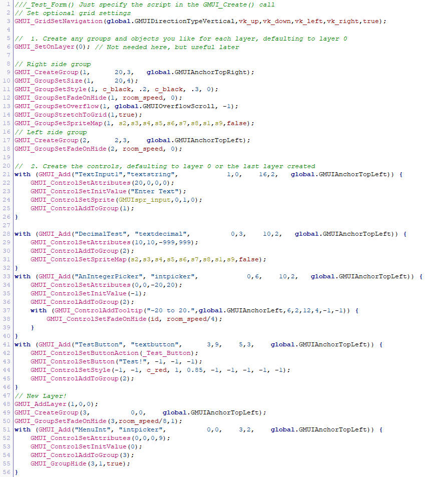
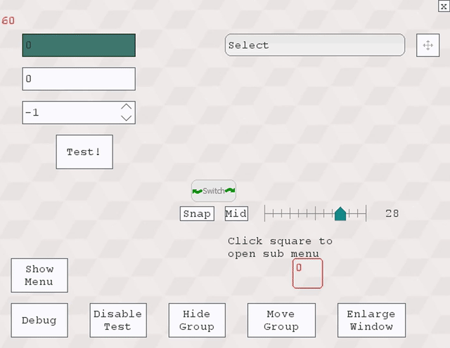
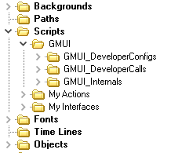

#  GMUI-Framework
## The Best Programmable Interface for Game Maker (Studio 2.x, 1.x & GM8!)

**INSTRUCTIONS: For the manual, please take a look at [the wiki](../../wiki)**

**Please note: New features and shortcuts can be added all the time! Take a look at the wiki for the latest documentation!**

<b>License:</b> GPL v3.0 (http://www.gnu.org/licenses/gpl-3.0.html)

## GMUI? What the? Why use this?
GMUI lets you programmatically create all of your interface controls through a GML script, and control them through script calls included in the framework.

That's right! This project is fully GML! - but don't worry, it is built with efficiency in mind. This allows you to structure and control your menus and even game controls without going crazy, and has all of the tedious tasks handled for you behind scripts you can call. You can do stuff like:

Customize **input fields**, **buttons**, **sliding** controls, and script calls for **grouping**, **layering**, **anchoring**, **pop-ups**, **menus**, **transitions**, and more!

Best of all, GMUI handles all of the code behind the scenes efficiently, making it much faster and easier to design your game's interface with better functionality and performance already built in. This may remind you of something like .NET apps with screens... Kind of ended up like it actually,.. interestingly enough...

## How do I use it, and what does it do?
GMUI takes this code from a Form script you create, and takes care of the rest (but still lets you easily interact with it):



So on and so forth... And turns it into this:




### Getting Started!
You must initialize the GMUI system in order to create grids. Typically, you'll want to put this in your persistent control object.

Then after it is initialized, you will need to create an object instance that will control your new grid:

```
GMUI_Init();		// You only want to call this once in your game, unless you destroy it later

newGMUI_ID = GMUI_Create(GMUI,MyGridScriptName,16,0); 		// e.g.: newGMUI_ID will have id of 1
```

Next, your interface object (In this case, 'GMUI') will only need to call a single script in the draw event.
DRAW EVENT:

`GMUI_GridDraw();`

Now your Grid is ready to be used, but we must make our own layout first!

## Creating The Grid
The folder structure contains all of the scripts and separates the internal commands from the ones that need to be modified, as shown here:


### Config script: GMUI_Settings
This script contains some values you can adjust for your grid. This includes the object used  as the controls, specified in the script:
`GMUI_controlobject = My_GMUI_control_object;`

*Note: This script may change to be form-specific in the next version*


### Folder: My Interfaces
This folder was created for your convenience as a place to put your own interface script files.

Use There are a number of scripts calls (in the GMUI_DeveloperCalls folder) to use to design your game's menus. When creating a new interface, first create a script that specifies the controls to create, then specify that script name as an argument when creating the interface. For example, this is used for calling the interface in the demo:

```
newGMUI = GMUI_Create(GMUI,_Test_Form,16,0);
```

#### Layers
The default layer is 0. Layers allow you to overlap controls on the screen, but can only be interacted with when viewing that layer. This can be used for submenu's for example. A GMUI instance can have multiple layers, and those layers can have multiple groups and controls.

#### Groups
Groups are in a layer and allow you to manipulate a group of controls at once (Moving, disable, hide, etc.) Here is an example of setting a variable for the layer number and adding groups:
```
// Group ID 1
GMUI_CreateGroup(1,     20,3, global.GMUIAnchorTopRight);
GMUI_GroupSetSize(1,    18,4);
// Group ID 2
GMUI_CreateGroup(2,     2,3,  global.GMUIAnchorTopLeft);
// Create another layer
GMUI_AddLayer(1,0,0);
// Change to another existing Layer
GMUI_SetOnLayer(0);
```

#### Anchoring and direction
You'll notice some global variables used for choosing anchors and direction (GM8. In Studio, we can use Enums). These are defined in GMUI_Init() (see wiki)
```
global.GMUIAnchor[*]
GMUIAnchor.[*] Right, TopRight, Top, TopLeft, Left, BottomLeft, Bottom, BottomRight
global.GMUIDirectionType[*]
GMUIDirection.[*] None, Right, Up, Left, Down
global.GMUIPopup[*]
GMUIPopup.[*] Blank, Information, Confirm, ThreeOptions
global.GMUISlide[*]
GMUISlideShape.[*] None, Line, Rect, RoundRect, FullRoundRect
global.GMUIOverflow[*]
GMUIOverflow.[*] None, Resize, Scroll
```

Anchoring lets you keep the controls in the same positions relative to the screen size, which may be handy when switching window or room size.

#### Adding a Control
Adding controls to the form has a different syntax, but makes it simple to add many controls and assign additional settings to them. You can even use your own sprites! For example:
```
//GMUI_Add(Name,Type,Cell-X,Cell-Y,Cells Wide,Cells High,anchor)
with (GMUI_Add("MyControl","textstring",            1,1,    16,2, GMUIAnchor.TopLeft)) {
    GMUI_ControlSetAttributes(20,0,0,0); // Define value constraints
    GMUI_ControlSetInitValue("Select"); // Define an initial value
    GMUI_ControlAddToGroup(1); // Add the control to a group
    GMUI_ControlSetSprite(sprite1,0,1,0); // With subimage # provided for normal, hovering, and selected
}
```
The **name** is important for value getting and setting and button actions.
**Cell X,Y** is based on the anchor position (TopLeft is default). If you are anchored to the opposite side, *positive* values will count *away* from the edge anchored to.
**Cells Wide,High** defines the size. This can also be fine tuned by calling a GMUI_ControlSetPositioning.
**Anchor** Picks the edge to anchor to. If the control is added to a group, it will anchor to the group's dimensions.

#### Control Types
Currently you can choose from the following: *(This will be changed to allow an Enum parameter soon)*
- **textint** - Integer field
- **textdecimal** - Decimal field
- **textstring** - String input
- **intpicker** - Integer field with arrows
- **doublepicker** - Decimal field with arrows (not completed)
- **spritepicker** - Sprite field with arrows
- **button** - Button to carry out an action when clicked (sprite based)
- **textbutton** - Button with text in it instead of a sprite
- **slider** - Slider control to select a value
- **checkbox** - Just as it sounds!
- **toggle** - Functionally a checkbox, but slides left/right or up/down
- **image** - Simply display a sprite
- **label** - Display text wrapped in the control area
- **selectlist** - Display a list of options to select from within the control area
- **tooltip** - Create a tooltip for a control, or use GMUI_AddTooltipToControl()

If you pass an object as the type instead of one of the built-in types, it will use that custom object instead.

#### Control Settings
You can call these scripts to change the control to the way you need them:

`GMUI_ControlSetStyle(Background Color, Border color, Hover color, hover border/rect, border alpha, Select color, Select alpha, show cursor)`

`GMUI_ControlSetStyle(Background Color, Border color, Hover color, hover border/rect, border alpha, font, font color, font align)`

`GMUI_ControlSetAttributes(max string length(or 0 for none), max decimal length (if applicable), min value, max value, )`

`GMUI_ControlSetPositioning( relative x, relative y, actual width, actual height )`

`GMUI_ControlSetPicker(picker width, picker height, picker direction, picker_right/up sprite, picker_left/down sprite)`

`GMUI_ControlSetButton(Text in button or "" , graphic inside button or -1 , sprite to replace drawn button or -1, font alignment or -1, text color on hover or -1)`

`GMUI_ControlSetInitValue(value)`
More will come in the near future with more controls and options.

#### Using a sprite map
You can use a series of sprites to map a control and/or a group, starting from the top section as the first sprite and going clockwise from there. Sprites are stretched to fit on all 4 sides.
```
GMUI_GroupSetSpriteMap(layer, group, sprTop,topRight,right,bottomRight,bottom,bottomLeft,left,topLeft,center,fixedCenterBool);
GMUI_ControlSetSpriteMap(sprTop,topRight,right,bottomRight,bottom,bottomLeft,left,topLeft,center,fixedCenterBool);
```
#### Control Tooltip
Add a tooltip on any side of a control by calling the script within a control block or by calling the control name.
```
with (GMUI_Add("name", "textstring", 0,0, 6,2, layer, global.GMUIAnchorTopLeft)) {
  with (GMUI_ControlAddTooltip("-20 to 20.",global.GMUIAnchorLeft, wide,high, max wide,max high,-1,-1)) {
    GMUI_ControlSetFadeOnHide(id, room_speed*100);
  }
}
// outside block
GMUI_AddTooltipToControl("name", "text here.",
global.GMUIAnchorLeft (left, right, top, or bottom),
cells wide or -1, cells high or -1,
max cells wide, max cells high,
relative x or -1, relative y or -1);
```

#### The Control Object
The object used for the control must make one call in the **Draw** event:

`GMUI_ControlDraw(true); // True will actually draw the control, as opposed to only running required tasks.`

### Menus & Popups
A major strength of the GMUI framework is the ability to anchor, layer, and group controls. Menus and popups combine all of these features.

Example for creating a menu, centered on the screen
```
// Instead of using the string of your menu name, you can use the ID number returned if you like
menuID = GMUI_CreateMenu("Test Menu",   GMUI_CenterX(0, 18, GMUIAnchor.Top) ,2,   18,24,   GMUIAnchor.Top);
GMUI_MenuSetClickOff("Test Menu", true);
GMUI_MenuSetStyle("Test Menu", c_black, 0.5, c_white, 0.75, true);
GMUI_MenuSetFadeOnHide("Test Menu", room_speed/4, 0);
GMUI_MenuSetHidePosition("Test Menu", -9, 6, easeExpOut, room_speed/2);
```
Then, to add a control to the menu:
`GMUI_ControlAddToMenu("Test Menu");`

And to open the menu:
`GMUI_ShowMenu("Test Menu",true,true); // true to show, and true to animate`

Popups are similar, but have different options that you are able to specify:
```
menuID = GMUI_CreatePopup("Test Popup",  -14,2,   28,12,   GMUIAnchor.Top, GMUIPopup.ThreeOptions);
GMUI_PopupSetMessage("Test Popup", "Click an option to return to the previous screen!", 2, -1, -1);
GMUI_PopupSetAction("Test Popup", _PopupReturnAction);
GMUI_PopupSetStyle("Test Popup", c_white, 1, c_white, 0.75, true);
```


### GMUI_SetLayerDepths
This script contains the depths of the advanced controls, like menus, popups, messages, etc. You typcially would not need to adjust these values.

These features are currently not implemented yet, but will be soon.

### GMUI_SetControlDefaults
All of the controls need to have default values if they are not defined. This script allows you to adjust these defaults to make it easier to fine-tune the settings you want for individual controls.

### GMUI_DrawDebug
This is a debugging script used to show any GMUI errors, show the grid lines, and the boundaries of groups. This may help to check to see that everything was set correctly. But realistically may only be used in a *(hint: menu creation tool)* possible new tool to design interfaces.

## Dependency Scripts
There are a few scripts that are used as shorthand calls to make it easier to develop with than using the long Game Maker functions. They are located in the GMUI -> GMUI_DeveloperCalls -> GMUI_Shortcuts folder:
* hsv - return color by hue, saturation, value
* rgb - return color by red, green, blue values
* color_alpha - set the color and alpha
* align - set the horizontal and vertical align
* minmax - take an original value and return it within the minimum and maximum values provided

## Extra Files
This repository contains an output script from GM8.1 that contains all of the scripts within it, and also has an XML configuration for it. This configuration file can be used by the [GMLScriptExploder tool](https://bitbucket.org/asmarkis/gmlscriptexploder).

## Demo
You can see a working demo from the GitHub release, or from here:
[Downloads Repository](https://bitbucket.org/asmarkis/gmui/downloads)

## Future Plans:
There are a number of features still left to implement, including:
- Slider control **** Needs to be added to readme ****
- Screen transitions (of the interface) **** Needs to be added to readme ****
- Font scaling
- Additional picker styles
- Radio type control

## Known issues:
- Formatting on the decimal field in the Studio version is not working properly
- Issue in GM:Studio version where switching rooms/adjusting layer may cause fade actions to affect all layers
- Moving the view (arrow keys) may negate menu functionality

Please look at the issues list in the Repo to see all outstanding issues or report a new issue. Thanks! :)
