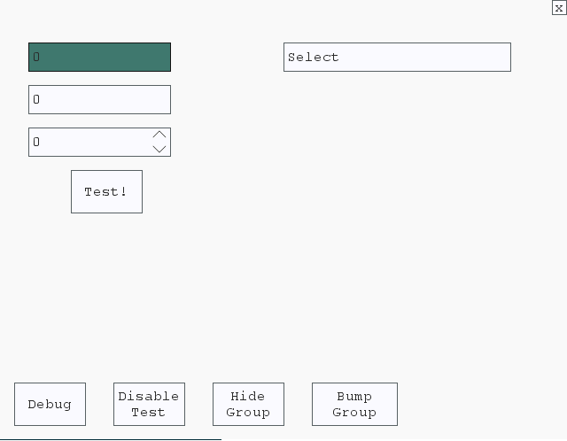

#GMUI-Framework
##The Best Programmable Interface for Game Maker
**WARNING: In Alpha Release! Expect rapid changes!!**

<b>License:</b> GPL v3.0 (http://www.gnu.org/licenses/gpl-3.0.html)

##Overview
GMUI allows you to programmatically create all of your interface controls through GML, and control them through script calls included in the framework. This allows you to structure and control your menus and even game controls without going crazy!

Currently, the framework typcially only handles input fields and buttons, but soon it will be able to handle sliding controls, lists, and other common items you would need.

##How does it work?
GMUI takes this code from the Form script, and takes care of the rest:


And turns it into this:




###Getting Started
You must initialize the GMUI system in order to create grids:

`GMUI_Init();`

After GMUI is initialized, you may create an object instance that will control your grid:

`instance_create(0,0,GMUI);`

Your object (E.g. GMUI) will need to call two commands in two events.
CREATE EVENT:

`newGMUI = GMUI_Create("MyGrid",16,0); // Grid Name, Cell Width, Cell Height`

DRAW EVENT:

`GMUI_GridDraw();`

Now your Grid is ready to be used, but now we must make our layout!

##Creating The Grid (GM8)
*This may change with GM:Studio*
The folder structure contains all of the scripts and separates the internal commands from the ones that need to be modified, as shown here:


###GMUI_Settings
This script contains some values you can adjust for your grid. This includes the object used  as the controls, specified in the script:
`GMUI_controlobject = GMUI_control;`


###GMUI_Form
Form is where you design your grid. There are a number of scripts to use to design your game's menus. It also has an argument passed in which you can optionally use to design multiple grids based on the name of the grid.

```
// If using multiple grids, you can switch between interfaces (optional):
switch (OptionalInterfaceName) {
    case "MyGrid": // Controls for MyGrid
```

####Layers
The default layer is 0. Layers allow you to overlap controls on the screen, but can only be interacted with when viewing that layer. This can be used for submenu's for example. A GMUI instance can have multiple layers, and those layers can have multiple groups and controls.

####Groups
Groups are in a layer and allow you to manipulate a group of controls at once (Moving, disable, hide, etc.) Here is an example of setting a variable for the layer number and adding groups:
```
layer = 0;
// Right side group
GMUI_CreateGroup(1,     20,3,   layer, global.GMUIAnchorTopRight);
GMUI_GroupSetSize(1,    18,4,   layer);
// Left side group
GMUI_CreateGroup(2,     2,3,    layer, global.GMUIAnchorTopLeft);
```

####Anchoring and direction
You'll notice some global variables used for choosing anchors and direction. These are defined in GMUI_Init() and should be treated like constants:
```
global.GMUIAnchorRight = 1;
global.GMUIAnchorTopRight = 2;
global.GMUIAnchorTop = 3;
global.GMUIAnchorTopLeft = 4;
global.GMUIAnchorLeft = 5;
global.GMUIAnchorBottomLeft = 6;
global.GMUIAnchorBottom = 7;
global.GMUIAnchorBottomRight = 8;

// Hovering directions for special controls
global.GMUIHoveringDirection_None = 0;
global.GMUIHoveringDirection_Right = 1;
global.GMUIHoveringDirection_Up = 2;
global.GMUIHoveringDirection_Left = 3;
global.GMUIHoveringDirection_Down = 4;

// Direction types
global.GMUIDirectionTypeHorizontal = 0;
global.GMUIDirectionTypeVertical = 1;
global.GMUIDirectionTypeSideVertical = 2;
```

Anchoring lets you keep the controls in the same positions relative to the screen size, which may be handy when switching screen sizes.

####Adding a Control
Adding controls to the form has a unique syntax to make it simple to add many controls and optionally assign additional settings to them. You can even use your own sprites! For example:
```
//GMUI_Add(Name,Type,Cell-X,Cell-Y,Cells Wide,Cells High,layer number,anchor)
with (GMUI_Add("MyControl","textstring",            1,1,    16,2,   layer, global.GMUIAnchorTopLeft)) {
    GMUI_ControlSetAttributes(20,0,0,0); // Define value constraints
    GMUI_ControlSetInitValue("Select"); // Define an initial value
    GMUI_ControlAddToGroup(1); // Add the control to a group
}
```
The **name** is important for value getting and setting and button actions.
**Cell X,Y** is based on the anchor position (TopLeft is default). If you are anchored to the opposite side, *positive* values will count *away* from the edge anchored to.
**Cells Wide,High** defines the size. This can also be fine tuned by calling a GMUI_ControlSetPositioning.
**Layer Number** needs to be a number of a current layer.**At the moment it is best to stay in layer 0.**
**Anchor** Picks the edge to anchor to. If the control is added to a group, it will anchor to the group's dimensions.

####Control Types
Currently there are 7 controls to choose from:
- **textint** - Integer field
- **textdecimal** - Decimal field
- **textstring** - String input
- **intpicker** - Integer field with arrows
- **doublepicker** - Decimal field with arrows (not completed)
- **button** - Button to carry out an action when clicked (sprite based)
- **textbutton** - Button with text in it instead of a sprite

If you pass an object as the type instead of one of the built-in types, it will use that custom object instead.

####Control Settings
You can call these scripts to change the control to the way you need them:

`GMUI_ControlSetStyle(Background Color, Border color, Hover color, hover border/rect, border alpha, Select color, Select alpha, show cursor)`

`GMUI_ControlSetStyle(Background Color, Border color, Hover color, hover border/rect, border alpha, font, font color, font align)`

`GMUI_ControlSetAttributes(max string length(or 0 for none), max decimal length (if applicable), min value, max value, )`

`GMUI_ControlSetPositioning( relative x, relative y, actual width, actual height )`

`GMUI_ControlSetPicker(picker width, picker height, picker direction, picker_right/up sprite, picker_left/down sprite)`

`GMUI_ControlSetButton(Text in button or "" , graphic inside button or -1 , sprite to replace drawn button or -1, font alignment or -1, text color on hover or -1)`

`GMUI_ControlSetInitValue(value)`
More will come in the near future with more controls and options.

####The Control Object
The object used for the control must make one call in the **Draw** event:

`GMUI_ControlDraw(true); // True will actually draw the control, as opposed to only running required tasks.`

###GMUI_SetLayerDepths
This script contains the depths of the advanced controls, like menus, popups, messages, etc. You typcially would not need to adjust these values.

These features are currently not implemented yet, but will be soon.

###GMUI_SetControlDefaults
All of the controls need to have default values if they are not defined. This script allows you to adjust these defaults to make it easier to fine-tune the settings you want for individual controls.

###GMUI_DrawDebug
This is a debugging script used to show any GMUI errors, show the grid lines, and the boundaries of groups. This may help to check to see that everything was set correctly. But realistically may only be used in a *(hint: menu creation tool)* possible new tool to design interfaces.

##Demo
You can see a working demo here:
[Downloads Repository](https://bitbucket.org/asmarkis/gmui/downloads)

##Future Plans:
There are a number of features still left to implement, including:
- Pop-ups
- Menus
- Tooltips
- Plain text labels
- List Areas
- Selection list control
- Screen transitions (of the interface)

##Known issues:
- Formatting on the decimal field in the Studio version is not working
